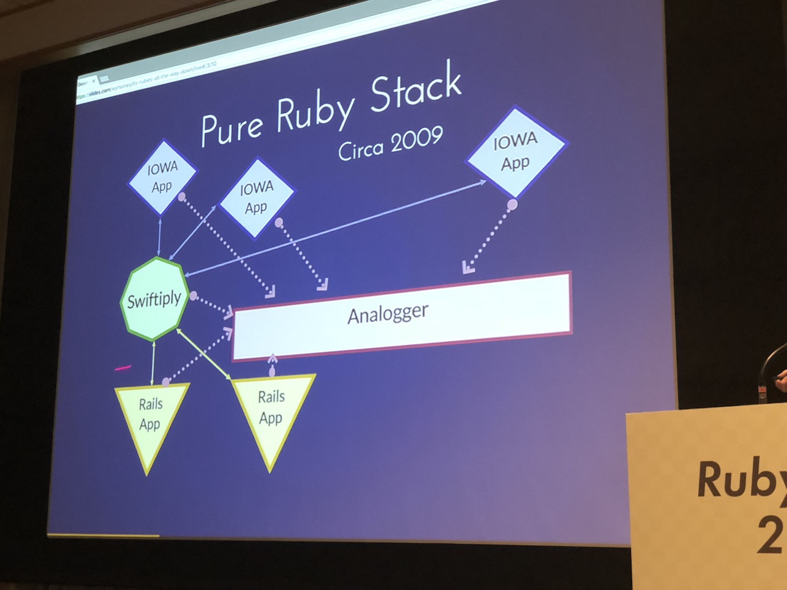
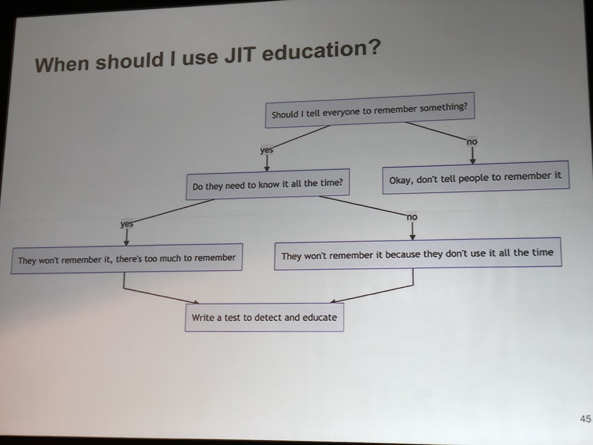

# Day 2:

## Kouhei Sutou - My way with Ruby (Keynote)

### Intro

What is a "keynote-ish" topic? You can either talk about one very specific think or give a broad overview. 

### Notes

Let's overview what can we do with Ruby.

* RSS Parser
  * Only parser with validation
* REXML - Ruby Electric XML
  * Used in RSS Parser

Another tool is Rabbit

* Rabbit
  * Presentation tool for Rubyists
  * RD (Ruby Document) support
  * Required some GUI
* Ruby/GTK3
* Ruby/GI
  * Automatic bindings generation
  * Used in Ruby/GTK3

When creating a tool you may miss some libraries. When creating those libraries we can either only add the functionality we need or create full featured library.

When creating Rabbit, we've created Ruby/GI which can now be used in many more places. For example in Pango and Poppler libraries. And we can quickly expand it to more and more tools - all of which are important for creating Rabbit. We need a library for graphic rendering, there is already rcairo so we can improve it and fix some bugs that were troubling us.

For the presentation tool we'll also need an easy way to install. The easiest way will be to satisfy all system packages dependencies during gem install. We can use rake-compiler for this. The same goes for testing. We'll use test-unit, but since it's missing some features we'll add them.

We've also looked at different libraries related to working with text (internationalization, full text search, text extraction etc), data processing (CSV and Apache Arrow) and Computer Vision.

## Kirk Haines - It's Rubies All The Way Down

### Intro

We'll take a look at how much of current web application stack can be handled by Ruby

You can find [the slides here](http://slides.com/wyhaines/its-rubies-all-the-way-down#/)

### Notes

What is a stack? Basically everything from log management, through database and web server all the way to load balancing. Usually only a few of those elements are done in Ruby.

Web development was very different a few years ago. There were no tools that we have today (rails or erb). In 2001 a PoC web framework IOWA was created. It allowed using much better architecture than other options - you were able to listen on a socket. Even first Rails versions were Apache centric.

It changed in 2006 with Mongrel, a fast web server written in Ruby. Also nginx was starting to get more popular choice than Apache. Then came Rack which changed how Ruby apps interacted with the web.

There was more and more places where you could use Ruby in your web stack. It seemed it would be possible to handle everything with Ruby. Need goood asynchronous logging? Write it yourself in a language that you already know. It turns out Ruby can do stuff like this fast enough. At this point we could have the whole stack except for the database written in Ruby.

If you need front end proxy there is a Ruby solution as well: [em-proxy](https://github.com/igrigorik/em-proxy). It turns out you can even use WEBrick to do the job, and with proper tuning it will be fast enough as well.

How about static asset caching? We can try combining Puma and Rack to do the job for us. It won't be the fastes solution but it may do the job for you. Similarly, creating a static assets webserver in puma is not much slower than using nginx. It's definitely fast enough.

For key-value store you've got ROMA. This is a distributed key-value store written in Ruby.

The only point missing is the database. And there is actually no Ruby solution for this one.

### Takeaways

Nowadays it's possible to use mature, well known tools written in Ruby to handle most of the web application stack tasks. However, it's worth keeping in mind that Ruby is not as fast as C or C++ so if performance is important for you, you'd better choose standard solutions. The other concern will be security. Software like nginx is really well tested by security experts, while smaller solutions may still have some critical bugs.

### Q&A

1. **Q**: What's the source of assumption that it can't be done?

   **A**: People still believe that Ruby is too slow for any serious task

2. **Q**: Why do you think nobody written a database in Ruby?

   **A**: The answer may be similar to the previous one. Most people probably thought that it's not the best language for the job

## Koichi ITO - Improve Ruby coding style rules and Lint

### Intro

Contributions to Rails, recently a lot of work in RuboCop (writing new cops)

RubyKaigi 2007 - talk on welcoming new people

Rubocop is organized around departments and cops - an analogy to how the police works. If there is not a cop that you need, you can easily write your own.

### Notes

Whats the difference between style and lint?

It's hard to define a style. There are many different coding styles (Minero Aoki, Shugo Maeda, Ruby Style Guide). RuboCop implements Ruby Style Guide by default. There are options allowing to change it's default behavior. Feel free to change the defaults to fit your needs. However, some options are missing and can't be easily changed in RuboCop.

And now about lint. This focuses on things that can turn into bugs or is about things like code duplication. There will be a new lint cop in Ruby 2.6. For example interface of ERB changes in 2.6. It will now expect keyword arguments in initializer. 

What's difference between `ruby -w` and RuboCop? RuboCop works before execution, while you'll have to actually execute the method for the `-w` option.

When doing code review and spotting an obvious offense it may be a good idea to create a cop for it so others could avoid the same mistake. Creating a new cop is really easy. You use a generator and write appropriate methods which instruct rubocop for patterns to match. Rubocop also gives you tools ot generate updated documentation. You can then create a pull request to rubocop so others could use your cop as well.

The more people use your cop the more likely you are to find bugs and edge cases in it. Since RuboCop doesn't have a pre-release version the cop will be used by a lot of people once it's accepted.

For example let's take a custom cop created by rails and used in their repository. After exporting it to RuboCop repository it would be possible for anyone using rails to keep the same style. Then, rails could drop their own implementation and actually use one that comes with rubocop. This allows whole community to write better code.

## Julian Nadeau - Scaling Teams using Tests for Productivity and Education

### Intro

Developer productivity team at Shopify

The presentation assumes you work with CI

### Notes

There are many different mistakes that can be made:

- Forgetting a `require`
- Including a gem that is similar to what is already there

But we won't focus on mistakes themselves, but rather on their impact on developers. When people have too many rules at the same time they may experience congitive overload where they won't be able to follow them at all. And the larger the organization the worse that problem may become. We need a way to help people avoid mistakes without explicitly telling tham what they can/cannot do.

We should try to automate all tedious tasks or the developers will be left with a list of pointless things to do. It's counterproductive and still prone to human error. And this may end up in your application being broken.

We use tests to avoid repeating logic or project errors in the future. But what about human errors?

There are a few important steps to fixing the problem:

1. Identify the problem
2. Determine if you can automate it
3. Make a test to educate developers

Example of a mistake may be wrong filename. For example when creating the file `some_task.rb` you're expected to create `some_task_test.rb`. Otherwise the CI will break. And you can actually write a test for this, right? It's as easy as looking for all `*_task.rb` files and checking if they have associated tests. Remember to add some useful message so the developer will know how to fix the issue. This will not only help the developers fix the issue, but also prevent them from pushing untested code to production.

Sometimes we may want to ban usage of specific gem or pattern. To do this we can create a "shitlist" which will list all offenses currently present int the project and slowly work on removing items from it. Now, we also write a test for this so if somebody adds some gem or pattern that we're trying to get rid of we'll notify them.

Such examples can be actually tested with your testing framework of choice. You don't have to only use them to test the code logic, but you can check the project with them as well. But those tests can become complex, so you can use some libraries that will help you such as Ripper API for code parsing, or Bundler API to check dependencies. But some tests may be as easy as reading filenames etc.

Another good way to tackle some probles is using style guides. A good choice may be using RuboCop to make sure that the code style is followed. Even though no single code style is more "right" than others, but it keeping it unified helps with development process.

Last think we'll talk about is Just in Time education. JIT here has a similar meaning to JIT compiling. It means that you don't educate people before they need the knowledge (or after), but exactly at the moment when they're about to make a mistake. That's actually exaclty what good tests will do. JIT education will therefore be made of following steps:

1. Detect that user doesn't know something
2. Explain what's the problem and how to fix it

Keep in mind to have helpful error messages. Example of bad message will be "A file `foo.rb` needs to have a test", because user may have written a test but named it wrong. It's better to say "A file `foo.rb` should have a test file named `foo_test.rb` but it wasn't found". Another thing to keep in mind is to explain why they need to to this, because nobody likes following rules blindly. And if possible try to suggest the correct solution.

We may actually take it a step further. Have you ever gotten an useless error from `bundle install`? It's possible that other people will have similar problems. We can try to make a wrapper that will format such errors nicely. Take a look at this [wrapper for bundler](https://github.com/jules2689/extended_bundler-errors)

Since version 1.13 bundler has support for plugins. They can be used for banning some gems or checking their sources.

### Takeaways

- Unit tests are not just for logic - use it for testing the project for human errors
- Rubocop can help enforce uniform code style

### Q&A

1. Q: Do you think that it's possible to write generic JIT education messages or will they be like the example you shown?

   A: The `rmagic` wrapper for bundler was a very specific case

2. Q: How would you approach microservices architecture?

   A: It depends on the project. You can either keep track of all of them globally or treat each one individually.

3. Q: Do you encourage developers to install RuboCop?

   A: No, we run it in CI and only on code that changed.