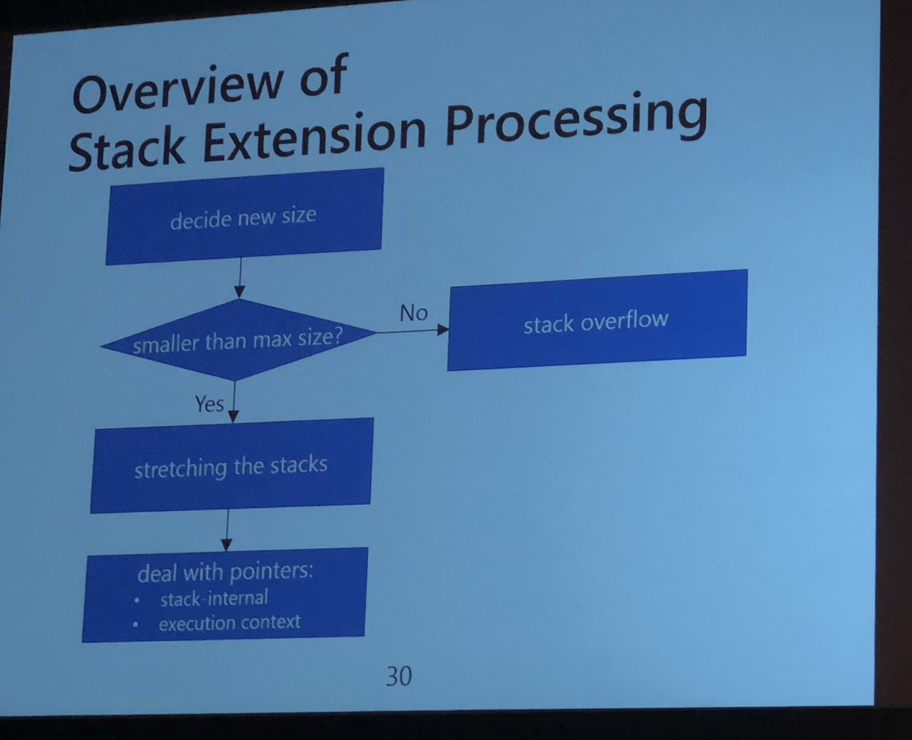
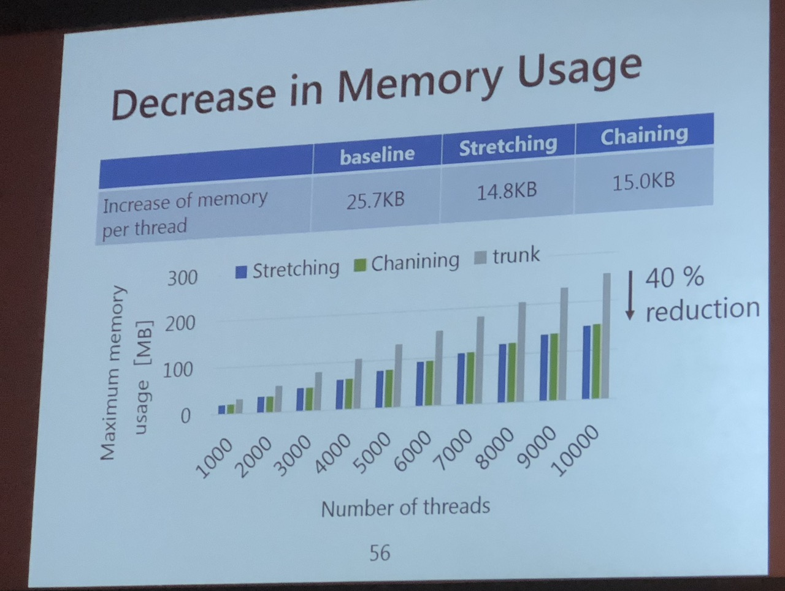
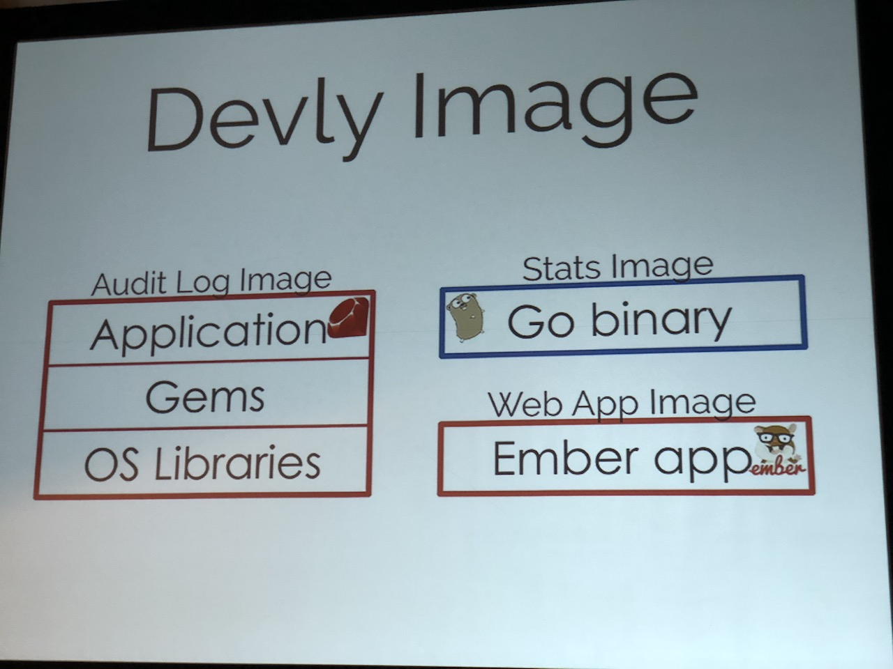
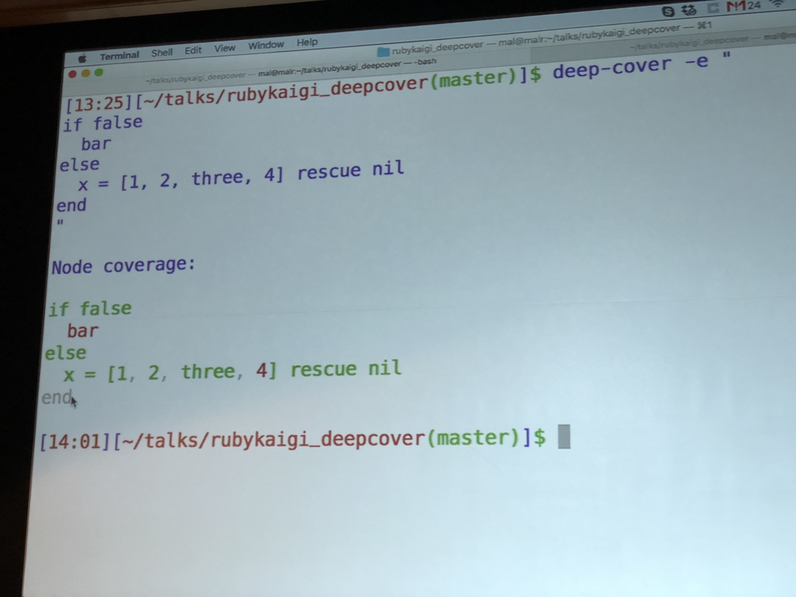
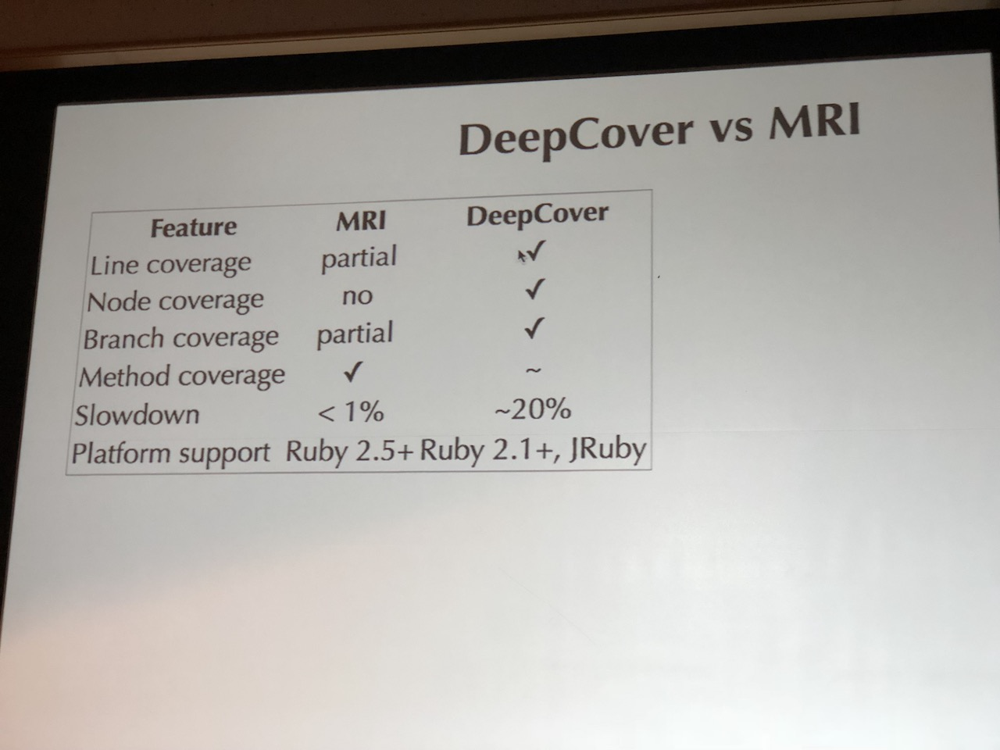
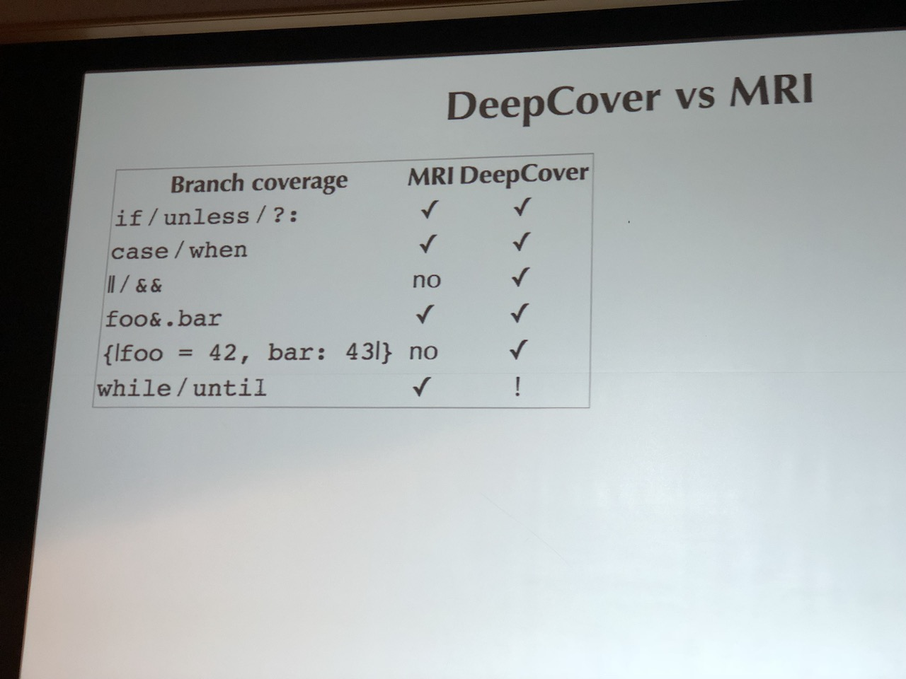
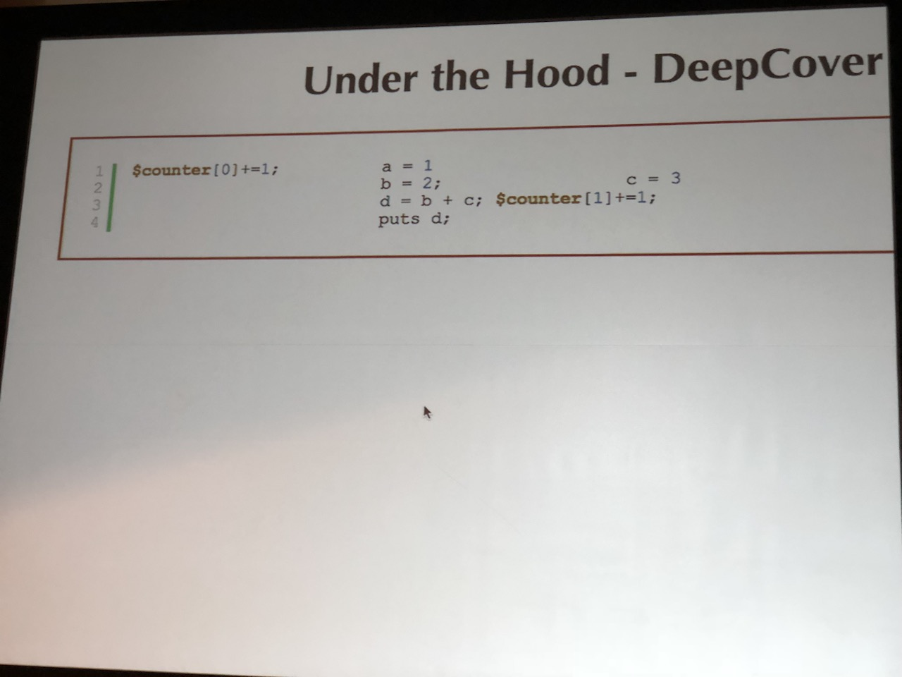

# Day 3:

## Benoit Daloze - "Parallel and Thread-Safe Ruby at High-Speed with TruffleRuby" (Keynote)

### Notes

TruffleRuby has two startup modes: either on JVM or on SubstrateVM which compiles Ruby to native executable. 

With Ruby 3x3 comming up there is a plan to make CRuby 3.0 3 times faster that 2.0, but do we have to wait until 3.0 (until at least 2020)? And should we only aim for 3x speedup?

[Demo of running OptCarrot with CRuby and TruffleRuby]

TruffleRuby already achieves close to 5x faster CPU performance than CRuby. Apart from CPU intensive tasks, TruffleRuby is also much faster at tasks like rendering ERB templates due to more performant String implementation. But it's still in early stages, so running big projects like Discourse is still a challenge. There are a lot of dependencies and many C extensions which need manual patching.

TruffleRuby achieves such speedup with Partial Evaluation and Graal JIT Compiler. 


Partial Evaluation speeds up a method execution chain by inlining methods, blocks and constant expressions thus simplifying the AST. Another thing that is done under the hood is optimizing data types usage. For example, while iterating you don't necesairly have to use ruby array, it can be changed to native jvm array which will be faster. Since we compile the code it's possible to perform even more optimizations like constant folding.

On the other hand we have different approach in CRuby and MJIT. It uses Ruby bytecode to create C libraries of methods that are used most often and use those libraries instead of Ruby version. But MJIT doesn't have access to Ruby binary so it cannot optimize calls to internal methods. We should focus on expanding JIT with a way to understant native Ruby methods so it can use this for further optimization.

The next part of the talk will be about Parallel and Thread-Safe Ruby. Dynamic languages tend to have poor support for parallelism, because of their implementation. Both CRuby and CPython have GIL which makes it impossible to execute parallel code in a single process. Solutions like JRuby or Rubinus have unsafe calls, so things like using `Array#<<` concurrently raises an exception.

Those problems are being slowly tackled by Guilds. It focuses on better memory model with almost no shared memory and no low level data races. But it would require many libraries to be rewritten, as it uses different approach than Ruby Threads.

If we try to concurrently append to an array we won't get problems in CRuby (but no real parallelism as well). Doing this with JRuby or Rubinus would require us to create a mutex, but it adds a significant overhead. Since Arrays are thread-safe in CRuby people assume that they will behave the same in other implementations, which leads to a lot of errors.

That's actually a hard problem. How do we make a collection thread-safe but don't add overhead for single-threaded operations? In dynamic languages there is a similar problem regarding objects. All objects' fields are basically a collection that can be modified at any given time. 

The idea for solving this is to only wynchronize objects that can be accesed by multiple threads. If something is used in a single thread only there is no need to add synchronization mechanism.

### Takeaways

TruffleRuby runs unmodified Ruby code faster. It also supports safe parallel execution (safe arrays will be available in a few months). It also supports Ruby Threads so there is no need to rewrite any piece of your code.

It shows that we can achieve high performance for Ruby with parallelism and no single-threaded overhead.

Try out TruffleRuby by installing it with your ruby manager of choice. 

### Q&A

1. **Q**: The setup time for TruffleRuby is but. Are there any plans to improve startup performance?

   **A**: We want to improve on this and there are some works already in progress. Loading code is indeed slower than it should be and improving this will be the next step.

2. **Q**: Is Partial Evaluation done by you or is there some framework for this?

   **A**: This is similar approach to what has been used for JavaScript. Actually AST interpreter doesn't care about the language.

3. **Q**: How does the memory usage differ between the implementations?

   **A**: SubstrateVM has bettter memory usage than JVM version.

## Keita Sugiyama, Martin J. Dürst - "Grow and Shrink - Dynamically Extending the Ruby VM Stack"

### Intro

Contributions regarding Unicode for Ruby

### Notes

There are more and more cores available in modern CPUs, but Ruby is still struggling with multi-threading. Each Ruby VM thread needs it's own stack. They are fixed in size to 1MB in order to avoid stack overflow. But the more threads you have the more memory you'll need just for those stacks.

Ruby VM actually uses two stacks. The first one is Call Stack which constains control frames (one per invocation). You'll be able to preview this stack with [feature #14801](https://bugs.ruby-lang.org/issues/14801). The other stack that is growing from the bottom is internal stack. It's used for executing instructions and there is one frame created per invocation.


The idea of Stack Extension was proposed by Koichi Sasada in 2016 and has been worked on since. When a potential stack overflow is detected we can double the stack size. 

Because the stacks move we'll have to take care of internal stack pointers as they will become invalid. Depending on pointer type we'll either adjust it's target or change the referencing method. For example for local variables we could change method from using direct pointers into using offset from start of stack. Conversion between pointer and offset is quite easy to perform.



There is one more problem with Ruby methods arguments. When passing them to C functions, they won't expect their position to change. We can tackle this by copying the values into a secure memory area.

While developing this feature there was a problem with debugging. Stack overflows happen too late and there is no access to the original stack. Instead of removing them we'll just mark them as unsused so we can preview them. The other problem is that stack extensions happened to rarely. The solution was to manually force stack extensions more frequently.

In the end all tests have passed, so it seems that there is a fully functioning implementation ready.

We can now check the impact on execution speed. On average the execution is 18% slower, possibly because we now use indirect access for call stack which requires more time. If we were able to keep call stack in the same place we could avoid the slowdown.

A new methodology was proposed. Instead of stretching we could use chaining (inspired by Lua's implementation). With chaining there is average of only 6% slowdown. Chaining is slower because we still have to move internal stack and copy arguments to C functions.

With dynamic stack size we could now change the initial stack size. It has almost no influence on execution speed but helps keep memory usage lower. In current implementation the initial stack size has been lowered from 1MB to 1KB. This allowed 40% reduction of memory usage. And it seems that the smaller the initial size, the greater the memory saving can be achieved.



But as it turns out, memory usage during tests was much lower than expected. With 10k threads and 1MB stack size we'll expect 10GB memory usage, but it was close to 250MB. (why? It was explained on the slides but they were changing too fast) 

We have to keep in mind that ruby memory is managed in four layers. Apart from Ruby VM layer that we're considering, there is also allocator (things like glib malloc), operating system (virtual memory) and hardware layer (caching etc).

### Q&A

1. **Q**: What methods exist for possible speed improvements?

   **A**: In current implementation the control frame is implemented one by one which is not good. We may also reduce number of time the stack is converted

2. **Q**: There are two stacks growing from top and bottom. You chain the top one, ist there room for chaining in the bottom one?

   **A**: When the argument is placed in memody the stack frame must extend. If you do that the internal stack must move and it's not effective.

3. **Q**: Call stack had become the the linked list. Ist this bi-directional?

   **A**: Yes, we're using bi-directional linked list. But we should actually be able to change it into single-directional one.

## Eric Hodel, Ezekiel Templin - "Devly, a multi-service development environment"

### Intro

API was initially made of a few small components and had a small development team. Soon it started growing and getting more complicated. Also, components were written in different technologies. It was becoming hard to keep all developers up to date with a proper environment.

### Notes

What can be done to solve the problem of maintaining a good development environment?

We want our environment to be:

- Reliable
- Accessible
- Maintainable
- Composable
- Reproducible

Only those 5 features together will provide us with a smooth experience. We will see how those features have been implemented in Devly.

Devly is build around images that consists of smaller app specific images.



Images are wrapped in services which know what command should be executed. It also alows you to share files with host os and interact with network interfaces. Many services may use the same image (think rails and sidekiq for the same application).

Services may then be organised into Racks that allow to run a few services at the same time. Sometimes it's not necessary to run all services so you can easily create another rack that only runs ones you need.

If you need to share some configuration between racks that's where you can use a Library.

Let's start by setting up devly and see how it works. All you need to do is execute `devly setup repo_url`. After the setup is complete you can see running services with `devly info`. Now, we can create a rack. The command to do this is `devly up`. After you're done with your work you can stop rack with `devly down`.

If somebody made changes to one of the images and you need to update it you can simply execute `devly pull image_name`. Since devly already knows about your repositories the change will be applied automatically.

Sometimes you may want to execute some custom commands inside running rack. To do this we can use `devly exec` command. If we're not sure about image structure we can always execute bash and explore what's going on. If we have some commands that we execute often (for example migrations or tests) we can use Saved Commands feature for this. It lets you easily define service and a command to execute on it. Then you just have to use `devly run` to execute one of your saved commands.

In bigger projects we sometimes need to have some cross-team collaboration. To change the image for one of the images we can tell devly to use our local changes for this one. This allows us to pull any branch we need and rebuild an image with it.

With the above commands it's easy for one team to use other team work without having to learn the technology they use. Devly can also be used for CI and testing.

Devly is not yet open source, but it's getting there soon. 

## Marc-André Lafortune - Deep into Ruby Code Coverage

### Intro

What is code coverage? It's a way of checking if your tests are sufficient. A line that was executed at least once is considered "covered". With code coverage it's easy to discover unused code or code with missing tests.

### Notes

We can consider different coverage types.

- Method coverage - counts how many methods have been executed. It doesn't measue what's inside of them.

- Line coverage - counts how many lines have been executed. But what about something like this

  ```ruby
  def foo(something: false)
    bar if something
  end
  
  # test
  expect(foo).to ...
  ```

  It will report 100% line coverage, but we can see that not the whole line was executed

- Node coverage - counts executed nodes in the AST (abstract syntax tree)

- Branch coverage - in some cases we may have 100% of node coverage but only because our code behaves differently for specific logic conditions. Branch coverage makes sure that we've tested all possible outcomes

We can see that branch coverage is the most in-depth so that may be something we want. And it has partial support since Ruby 2.5 and will have even better in 2.6. But you could have been using it since Ruby 2.1 with [deep-cover](https://github.com/deep-cover/deep-cover) gem.



Because branch coverage were missing from the previous versions of Ruby a lot of popular libraries are not actually tested properly even though they often have really high coverage.

With deep-cover it's easy to find examples of untested guard clauses, endge cases and even unused scopes.

But does it make sense to use deep-cover if we have some branch coverage support in MRI already? It turns out that MRI is still missing node coverage and doesn't actually cover all kinds of branches that deep-cover does.





If you're already using a library like `simplecov` there is an easy way to migrate to deep-cover with their `builtin_takeover` module.

Ok, so how does this work under the hood?

Of course we need counters to keep track of how many times we've been in any specific point in code. While MRI tracks line coverage it's happening on C level, but deep-cover simply appends ruby counter incrementation before each line of code. But it doesn't have to track every line, because some lines are always executed together. To rewrite the code, deep-cover uses the [parser gem](https://github.com/whitequark/parser). Based on those counters further information can be extracted.



Tracking method calls and other more complex syntax requires deep-cover to do some more complex rewritting. Trackers have to be inserted between specific steps of code execution.

In the end the whole idea is as simple as putting trackers/counters in every place where a control flow could be interrupted. This gives us an accurate measure of what parts of code were actually executed.

The deep-cover gem works well for now and there are a lot of features comming up.

### Q&A

1. **Q**: Have you been talking to somebody from Coveralls?

   **A**: Not to Coveralls. We've talked to maintainers of simplecov and they said the integration is possible

